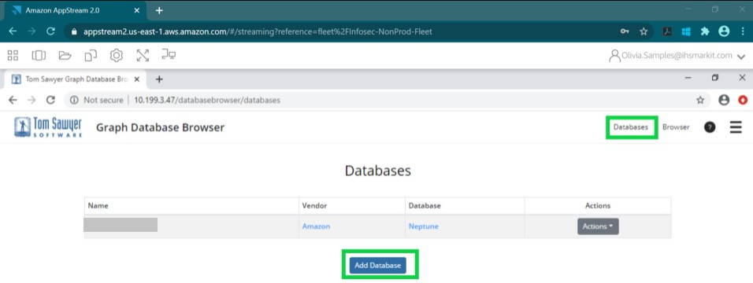

# Amazon Neptune Enablement w/ GREMLIN & Python
This repository provides the details for the deployment and loading of data into Amazon Neptune using the Python module for Apache's SparklePop GREMLIN directory traversal language in order to simplify the deployment and loading of data for future use cases.

## Background
---
Amazon Neptune is a fast, fully managed graph database service that supports property graph with Apache TinkerPop and Gremlin Language traversals. We will use this graph database to essentially connect lots of semi-connected pieces of data to traverse one relationship in order to get to the target relationship. In order to do so, we must automate Neptune deployment. 
With the addition of new team members and the commitment to developing the reporting engine of Cyber Risk graph we need to create acceptable patterns for how we stage our data and then how we create relationships from it. We will use CloudFormation and Python scripts to standardize this process for consistent redeployment purposes. This give us a single source of truth for our graph database resources. 

## Security Benefits
---
By automating the collection of Whitesource software composition analysis (SCA) information (e.g. vulnerabilities & policy violations), the Global Cloud Security Team can create more accurate reporting and determine inherent risk to assets more accurately.

> - Increase digestability of data with complex relationships via efficient graph querying.

> - AWS-native implementations which utilize serverless technologies: cost-effective and highly scalable and can be implemented easily by AWS teams for localized copies of the same data the Global Cloud Security Team will collect.

## Build and Test

### Deploy Neptune DB via CloudFormation
---
We will create a Neptune DB via CloudFormation. Console instructions for this can be found [here](https://docs.aws.amazon.com/neptune/latest/userguide/manage-console-launch.html). Using the ***NeptuneDBCloudFormation.yaml*** template for an AWS CloudFormation Stack, we will be creating all necessary resources to efficiently load the database. 

1. Download the CloudFormation template from the 'src' folder in this repository titled ***NeptuneDBCloudFormation.yaml*** to your local machine (not Cloud9!).

2. Navigate to the **AWS CloudFormation** console, select **Create stack**, and choose **With new resources (standard)** as shown below.

    

3. Select the radio button for **Upload a template file**, select **Choose file**, and then find the CloudFormation template you downloaded in Step 1 with the Windows Explorer and select **Open** as shown below.

    

4. After your local CloudFormation template loads select **Next**. On the next screen enter a **Stack name** and then make a selection for the Parameters. After you have entered the details select **Next** at the bottom-right of the screen as shown below.

    

    **Important Note:** Ensure that you are selecting a ***VPC** for your Database and a ***Security Group** that the created Security Group within the template *can talk to*. For instance, I chose my Cloud9 Security Group for the Security Group parameter.

5. On the next screen scroll down and choose **Next**. In the following screen scroll down, acknowledge the message (**I acknowledge that AWS CloudFormation might create IAM resources with custom names.**) and choose **Create stack** as shown below.

    

6. Once this stack is complete, the Neptune DB will be deployed. You can find it within the AWS Neptune Console shown below.

    

### Configure Data for Loading into Neptune DB
---
Amazon Neptune's `Load` API requires the data to be in a specific format. These specific formats can be found [here](https://docs.aws.amazon.com/neptune/latest/userguide/bulk-load-tutorial-format.html), where we will be using `csv` since we will be loading via Gremlin. If your data is not in a supported format, you must convert it before you load it into a Neptune DB instance. A solution to do so has been provided in the 'Load DynamoDB Data Table into Neptune DB via **Python Script**' section of this repo.

[To convert your data from a relational database](https://www.tibco.com/sites/tibco/files/resources/sb-graph-database-final.pdf), you must first define the data types and their relationships. For instance, a normal relational database looks likes the below photo, where the data types are the boxes and the arrows show their relationships. We want to convert it to a graph database because it has so many relationships. The IDs originally used for joins are now how we create relationships in a graph database. There should always be a node ID to reference in order to create edges from two nodes. We will provide two example datasets for further understanding.


### Example Datasets to Load **Outside of our AWS Account**
---

Before we load the files, we will create an S3 bucket and secure it. Within your Cloud9 virtual environment, be sure to install `awscli` and `boto3`.

```bash
pip3 install awscli
pip3 install boto3
```
Create a python file to load the following script. This script will create the bucket and encrypt the bucket.

```py
import boto3

s3 = boto3.client('s3')
sts = boto3.client('sts')

awsAccountId = sts.get_caller_identity()['Account']
bucketName = 'neptune-db-gremlin-data' + awsAccountId

response = s3.create_bucket(
    ACL='private',
    Bucket = bucketName
    )
print(response)

response = s3.list_buckets()
try:
    for bucket in response['Buckets']:
        bucketName = str(bucket['Name'])
        response = s3.get_bucket_encryption(Bucket=bucketName)
except Exception as e:
    if str(e) == 'An error occurred (ServerSideEncryptionConfigurationNotFoundError) when calling the GetBucketEncryption operation: The server side encryption configuration was not found':
        response = s3.put_bucket_encryption(
            Bucket=bucketName,
            ServerSideEncryptionConfiguration={
                'Rules': [
                    {
                        'ApplyServerSideEncryptionByDefault': {
                            'SSEAlgorithm': 'AES256'
                        }
                    }
                ]
            }
        )
        print(response)
        print('Encryption applied to ' + bucketName)
    else:
        print(e)
        raise
```

The `bucketName` must be a unique value, hence why `awsAccountId` variable is introduced. You can replace 'quicksight-enablement' with your specific bucket name. After executing the file, you can use the below command to retrieve the full version of the generated `bucketName` once its created. This command returns a list of all S3 buckets, so you can pinpoint your S3 bucket's unique name from this list.

```bash
aws s3api list-buckets --query "Buckets[].Name"
```
1. For our first dataset example, we will use the [Zachary Karate Club](http://konect.cc/networks/ucidata-zachary/) data from [UCI's Network Datasets](http://vlado.fmf.uni-lj.si/pub/networks/data/ucinet/ucidata.htm#kazalo). This data is already separated into edges and nodes and prepared in the Gremlin CSV format. Now we will upload the edge file and the node file to the S3 Bucket.

    ```bash
    git clone https://ihsmarkit@dev.azure.com/ihsmarkit/Infosec/_git/Amazon-Neptune-(Graph-DB)-Enablement
    cd Amazon-Neptune-(Graph-DB)-Enablement/Amazon-Neptune-Enablement-w-GREMLIN-&-Python
    aws s3 cp edge.csv s3://YOUR_BUCKET_NAME/karate/
    aws s3 cp node.csv s3://YOUR_BUCKET_NAME/karate/
    ```
    This dataset is very basic, as it has each karate student as a node, and their relationship with another student as a node. In this example, the reference id was the student.

    As you can see, the files are in the appropriate gremlin format. The nodes represent each student within the karate class. 

    

    The edges represent each relationship between each student in the karate class. You can see that the first relationship is between the first student and the second student, and so on.

    

2. The second dataset we will use is from the U.S. Department of Transportation for [Airline Flight Statistics](https://www.transtats.bts.gov/DL_SelectFields.asp?Table_ID=). We can load this directly from GitHub using the following script.

    ```py
    import csv
    import pandas as pd
    import numpy as np

    #Global Variables
    bucketName = 'YOUR_S3_BUCKET'

    edges = pd.read_csv(r'https://raw.githubusercontent.com/krlawrence/graph/master/sample-data/air-routes-latest-edges.csv')
    nodes = pd.read_csv(r'https://raw.githubusercontent.com/krlawrence/graph/master/sample-data/air-routes-latest-nodes.csv')

    nodesdf= pd.DataFrame(nodes).iloc[:, np.r_[0:7]]

    pd.DataFrame(edges).iloc[:, np.r_[0:4]].to_csv(r'./airline_edges.csv', index=False)
    nodesdf.to_csv(r'./airline_nodes.csv', index=False)
    ```
    To load this data into our S3 bucket, run the following lines.
    ```bash
    aws s3 cp airline_edges.csv s3://YOUR_BUCKET_NAME/airlines/
    aws s3 cp airline_nodes.csv s3://YOUR_BUCKET_NAME/airlines/
    ```
    This dataset provides a few more complex relationships. The nodes represent each airport instance and are labeled as such, but it also provides a lot more information related to these unique instances as other properties. We removed some of these in our example for simplicity's sake.

    

    The edges represent how each flight instance relates to eachother, labeled as the route taken and provides a distance property for further description of the edge. We had to remove the description within our loading process as it is not allowed for the gremlin format. 

    

### Load Gremlin formatted data to Neptune DB from S3 Bucket via the **Command Line**
---

1. Now we will connect to our Neptune DB to load the data. We will load the data using the following command wihtin our Cloud9 AWS CLI.

    ```bash
    curl -X POST \
        -H 'Content-Type: application/json' \
        https://your-neptune-endpoint:port/loader -d '
        {
        "source" : "s3://bucket-name/sub-folder/",
        "format" : "csv",
        "iamRoleArn" : "arn:aws:iam::account-id:role/role-name",
        "region" : "region",
        "failOnError" : "FALSE",
        "parallelism" : "MEDIUM",
        "updateSingleCardinalityProperties" : "FALSE",
        "queueRequest" : "TRUE"]
        }'
    ```
    You can replace **your-neptune-endpoint** with the endpoint for your neptune cluster, replace **port** with `8182`, **bucket-name/sub-folder** with the S3 bucket and subfolder (e.g. karate or airlines) that you loaded the files into.
    You can replace **iamRoleArn** with the iamRoleArn we created in the stack, replace **region** with the region the DB Cluster is in (e.g. us-east-1). 

2. As stated in the [Loader Instructions](https://docs.amazonaws.cn/en_us/neptune/latest/userguide/bulk-load-data.html), you can use the job `id` that you receive to check and see the status of the load.

    ```bash
    {
    "status" : "200 OK",
    "payload" : {
        "loadId" : "ef478d76-d9da-4d94-8ff1-08d9d4863aa5"
    }
    }
    ```
    Using the `loadId` response (similar to the above), run the following command to check the status of the curl.

    ```bash
    curl -G 'https://your-neptune-endpoint:port/loader/ef478d76-d9da-4d94-8ff1-08d9d4863aa5'
    ```

### Load DynamoDB Data Table into Neptune DB via **Python Script**
---
Now that we have explored the basics for what the data is supposed to look like and how to load it via the command line, we will load our own AWS Account data into the Neptune DB cluster.

1. You will to clone the following python modules to your Cloud9 instance. The origin of `neptune.py` file can be found [here](https://github.com/aws-samples/amazon-neptune-samples/blob/master/neptune-sagemaker/notebooks/util/neptune.py), and the origin of the `neptune_ptyhon_util.zip` file can be found [here](https://github.com/awslabs/amazon-neptune-tools/tree/master/neptune-python-utils). These modules allow us to access a neptune instance so that we can [bulkLoad](https://aws.amazon.com/blogs/database/analyze-amazon-neptune-graphs-using-amazon-sagemaker-jupyter-notebooks/) our data into our cluster without using the command line. 

    Since we have already cloned this repository when creating the S3 bucket, be sure to drag and drop these files into the exact directory you are working out of. Otherwise, refer to the S3 bucket section for cloning this repo.

2. Create a python file named `'ddbtoneptune.py'` and paste the following script. You will need to update the parameters to your corresponding `'bucketName'`, `'region'`, `'neptuneEndpoint'`, and `'arnRole'`. 

    This script loads in all of the RiskReconFindings from DynamoDB, creates a relationship from the 'FindingID' to the 'OrganizationID', loads the nodes and edges files into our S3 Bucket, and bulk loads those files into the Neptune DB cluster.

    You can update the relationship as you wish. Change the very first index in `'specifyProperties1'` and `'specifyProperties2'` as the beginning and endpoint of the edge relationship you are wanting. Alter the other indices to correspond to the chosen primary index.

    For instance, we have chosen **4** as the first index which is the `'FindingId'`. The rest of the indices for `'specifyProperties1'` correspond to the properties relating to `'FindingId'`. We have chosen **7** as the first index for the second list which corresponds to `'OrganizationId'`. The rest of the indices for `'specifyProperties2'` correspond to the properties relating to `'OrganizationId'`, like `'OrganizationName'` and `'OrganizatoinShortName'`. 

    ```py
    import boto3
    from dynamodb_json import json_util as json
    import pandas as pd
    import numpy as np
    import csv
    from neptune import Neptune

    #Parameters
    tableName = 'RiskReconFindings'
    bucketName = YOUR_S3_BUCKET_NAME
    region = YOUR_NEPTUNE_DB_REGION
    neptuneEndpoint = YOUR_NEPTUNE_ENDPOINT
    arnRole = YOUR_ARN_ROLE_FOR_NEPTUNE_DB
    specifyProperties1 = np.r_[4, 0:4, 5, 6, 8, 10:14] #!Ref Type List<Number> in the brackets
    specifyProperties2 = np.r_[7, 9, 14] #!Ref Type List<Number> in the brackets
    edgeLabel = 'Findings from Organization'
    nodesdf1FileName = "nodesdf1.csv"
    nodesdf2FileName = "nodesdf2.csv"
    edgesFileName = "edgesdf.csv"
    s3SubFolder = 'riskrecon/'

    #Create client
    client = boto3.client('dynamodb')
    db = boto3.resource('dynamodb')


    #Convert from json to dataframe
    def convert_json_to_df(tableName):
        table = db.Table(tableName)
        response = table.scan()
        data = response['Items']
        
        while 'LastEvaluatedKey' in response:
            response = table.scan(ExclusiveStartKey=response['LastEvaluatedKey'])
            data.extend(response['Items'])
            
        return(pd.DataFrame(json.loads(data)))
        
    #Select Columns for new Data Frames
    def select_columns(data_frame, properties):
        new_frame = data_frame.loc[:, data_frame.columns[properties]]
        return new_frame

    def create_edges(nodesdf1, nodesdf2, edgeLabel):
        df = pd.DataFrame({'~from': nodesdf1[nodesdf1.columns[0]], '~to': nodesdf2[nodesdf2.columns[0]], '~label': edgeLabel})
        df.reset_index(inplace=True)
        df = df.rename(columns = {'index':'~id'})
        df['~id'] = 'edge:' + df['~id'].astype(str)
        return(df)

    # Rename Node Columns to go with Gremlin format
    def rename_columns(data_frame):
        for i in range(len(data_frame.columns)):
            data_frame.rename(columns= {data_frame.columns[i]: data_frame.columns[i] + ':String'}, inplace = True)
        data_frame.rename(columns={data_frame.columns[0]: '~id'}, inplace=True)
        
        return(data_frame)

    # To local csv
    def node_to_csv(data_frame, fileName):
        new = rename_columns(data_frame).drop_duplicates()
        new.to_csv(fileName, index=False)

    # Upload new files to S3 bucket
    def upload_to_s3(fileName, bucket, s3SubFolder):
        s3 = boto3.client('s3') 
        s3.upload_file(fileName, bucket, s3SubFolder + fileName)

    def main():
        df = convert_json_to_df(tableName)
        node1df = select_columns(df, specifyProperties1)
        node2df = select_columns(df, specifyProperties2)
        node_to_csv(node1df, nodesdf1FileName)
        node_to_csv(node2df, nodesdf2FileName)
        create_edges(node1df, node2df, edgeLabel).to_csv(edgesFileName, index=False)
        

        upload_to_s3(nodesdf1FileName, bucketName, s3SubFolder)
        upload_to_s3(nodesdf2FileName, bucketName, s3SubFolder)
        upload_to_s3(edgesFileName, bucketName, s3SubFolder)

        # Bulk Load into Neptune DB
        Neptune.bulkLoad(Neptune, source = 's3://' + bucketName + '/' + s3SubFolder, role = arnRole, region=region, neptune_endpoint=neptuneEndpoint, neptune_port=8182)

    main()
    ```
    Execute this script, and you will see that the load completed. If you encounter an error, troubleshoot using the [error status call](https://docs.aws.amazon.com/neptune/latest/userguide/load-api-reference-error-logs-examples.html).


### Connect to Neptune DB via Gremlin and Construct example GREMLIN Traversals for Neptune DB
---

1. We will now connect to the database using Gremlin. The following script shows you how to connect to the database along with explore the edges and nodes that have been loaded into it. Copy this into a python file and execute it within the command line.

    **Important Note :** This script can be inserted into the above module to perform graph traversals all at once. We have seperated it here for example purposes.
    
    ```py
    import os
    from neptune import Neptune

    # Parameters
    neptuneEndpoint = os.getenv('NEPTUNE_ENDPOINT', '')

    # Connect to the database and create a graph traversal using the module: neptune.py
    g = Neptune.graphTraversal(Neptune(), neptune_endpoint=neptuneEndpoint, neptune_port=8182, show_endpoint=True, connection=None) 

    # Select a specific node. In this example, we select a specific node from the Organization Node Set of the RiskReconFindings data table
    n0 = g.V().has('OrganizationShortName', 'IHS Markit')
    # Get all edges for this node
    n0_edges = n0.bothE().toList()
    # For each edge, get the id of the peer node
    n0_peers = [ e.outV.id for e in n0_edges ]
    # Print these ids
    print(n0_peers)

    

    # Show distribution of Risk Recon Findings by Severity
    vertices1= g.V().hasLabel('FindingsID').groupCount().by('SeverityNumeric').toList()
    print(vertices1)

    # Display the unique organizations that represent nodes
    vertices2= g.V().hasLabel('OrganizationID').groupCount().by('OrganizationShortName').toList()
    print(vertices2)
    ```

    In this example using the **RiskReconFindings** dataset, we reference the property 'OrganizationShortName' and specify 'IHS Markit'. If we would like to use the airlines dataset or the karate dataset, we could reference a different property. For instance, we could reference 'Code' and the value 'ATL' to return all the edges and groupings with the Atlanta Airport.

    ```py
    n0 = g.V().has('code', 'ATL')
    ```
    Or we could reference 'name' and 'node0' to return all the student relations of the first karate student.

    ```py
    n0 = g.V().has('name', 'node0')
    ```

    There are many [other commands](https://tinkerpop.apache.org/gremlin.html) that you can use to explore this data. 

### Visualize query results using MatPlotLib
---

1. You will need to clone the `visualisation.py` python module to your Cloud9 instance. The origin of `visualisation.py` file can be found [here](https://github.com/aws-samples/amazon-neptune-samples/blob/master/neptune-sagemaker/notebooks/util/visualisation.py).

    Since we have already cloned this repository when creating the S3 bucket, be sure to drag and drop this file into the exact directory you are working out of. Otherwise, refer to the S3 bucket section for cloning this repo.

2. Now we can create a `plot.py` python script to paste the below into.

    ```py
    import os
    from neptune import Neptune
    from visualisation import Visualisation

    # Parameters
    neptuneEndpoint = 'YOUR_NEPTUNE_ENDPOINT'

    # Connect to the database and create a graph traversal using the module: neptune.py
    g = Neptune.graphTraversal(Neptune(), neptune_endpoint=neptuneEndpoint, neptune_port=8182, show_endpoint=True, connection=None) 

    #Get the nodes with a 'high' Severity Label
    v = g.V().has('FindingsID', 'SeverityLabel', 'high')

    ##################################################################
    # Plot the findings based on Organization Short Name
    path = v.out().path().by().by('OrganizationShortName')

    #Get these node labels to colorize the plot
    labels = g.V().values('OrganizationShortName').toList()

    #Plot the graph
    Visualisation.plotPaths(Neptune, path, labels, fig = './plot.png')
    ```
    You will get the following graph as an output. Not very pretty because of the limitations of MatPlotLib, but we can see that 'IHS Markit' has the most findings with a 'high' Severity Label.

    

    Now we can go into more detail using the below script.
    ```py
    ##################################################################
    #Get the path to it's peer node and label the start node based off of 'SecurityCriteria' and the end node based off of 'OrganizationShortName'
    path = v.out().path().by('SecurityCriteria').by('OrganizationShortName').toList()

    #Get these node labels to colorize the plot
    labels = g.V().values('OrganizationShortName').toList()

    #Plot the graph
    Visualisation.plotPaths(Neptune, path, labels, fig = './plot2.png')

    ```
    This plot shows us what 'Security Criteria' each Organization has when they have a 'high' Severity Label.

    

    As you can see, neither of these plot options are easy to read, so we will look into a tool called Tom Sawyer for improved visualization.

### Visualize query results using Tom Sawyer Software
---

This section will provide the steps for deploying the Tom Sawyer Graph Database Browser for Amazon Neptune. 

1. We will begin with subscribing to the software via this [link](https://aws.amazon.com/marketplace/pp/Tom-Sawyer-Software-Tom-Sawyer-Graph-Database-Brow/B07JGBY4GJ).

2. From there, follow the steps provided in the Tom Sawyer Graph Database Browser 9.0.0 AMI Deployment Guide for [Launching the Server](https://www.tomsawyer.com/graph-database-browser/TSS.GDBB.9.0.0.AMI.DeploymentGuide.pdf).

    Note (Step 4): When choosing **Network** choose the same VPC that your Neptune DB was created in. Also, because the purposes of this enablement is for sensitive data, select a private **Subnet**. 

    Note (Step 6): Select the same **Security Group** that was created with the Neptune DB CloudFormation template. Make sure that the security group has inbound rules for itself, http, and https.

3. Now, in order to use the application, you are required to have access to [Amazon AppStream](https://aws.amazon.com/appstream2/?blog-posts-cards.sort-by=item.additionalFields.createdDate&blog-posts-cards.sort-order=desc). Log into your AppStream session and open a web browser.

    From there, you can follow the steps provided in the same Deployment Guide for [Using the Application](https://www.tomsawyer.com/graph-database-browser/TSS.GDBB.9.0.0.AMI.DeploymentGuide.pdf).

    Your `{instance-url}` is your Private IPv4 address.

4. Once you have succesfully logged into Tom Sawyer, we can prepare a database to load in our Neptune DB. 
    
    

    The 'Vendor' and 'Database' should be the same, and 'Name' and 'Description' can be unique to your database. Save the database once you are done.

    

5.  From your database, select 'Connections' from the 'Actions' drop down. Now we will connect our Neptune DB.

    

    After selecting 'Add a Connection', fill out the template as follows.
    
    

    Be sure to use your Neptune DB's **Reader Endpoint** as your Cluster Endpoint reference.

    

    **Important Note:** We will NOT be selecting IAM Database Authentication in this POC. In fact, we will need to disable the cluster's IAM Database Authentication as shown below in order to succesfully connect.

    

    To disable your IAM DB Authentication, modify your cluster and disable Authentication.

    

    Be sure to apply this immediately. Once this has been applied, we can connect to the Neptune Database.

    


6. From your connection within Tom Sawyer, select 'Connect' from the 'Actions' drop down. 

    

    Your database will load and you can begin graphing!

    

7. Visualizing the same query as before, Tom Sawyer provides us with a lot more detail as you can see in the below. We can explore more queries and options in the future.

    

## Contribute
---
If there are links or sections you feel that should be in here please open up a PR by creating a Branch under your name and pushing to mainline!


